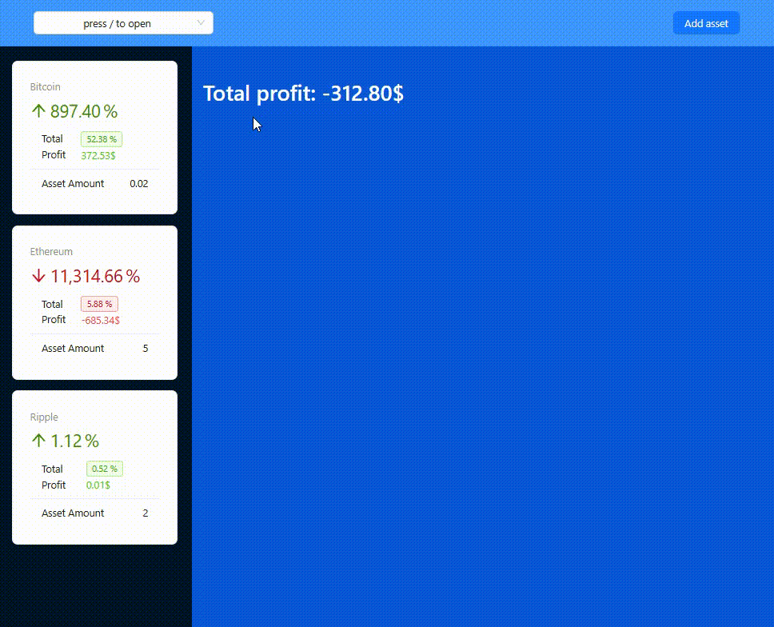

# Crypto WebApp

## Overview

**Industry:** Web Application  
**Type:** Individual Project  
**Categories:** React, Vite  
**Date:** 2024  
**Timeline:** 3 hours

## Description

The **Crypto Portfolio Management Application** is a React-based app designed to help users track their cryptocurrency investments. It provides features for adding and managing assets, viewing real-time data, and calculating profits or losses based on historical asset prices. The app integrates with a simulated backend to fetch real-time cryptocurrency data and manage user-owned assets, helping users make informed decisions about their portfolios.

## Features

### Portfolio Management

- Add and manage cryptocurrency assets with custom amounts and purchase prices
- Track total portfolio value and overall profit/loss
- View detailed information about each coin in the portfolio

### Real-Time Data Fetching

- Fetch real-time cryptocurrency data through simulated API calls
- Displays current prices, market cap, and other coin-related information
- Shows price changes over the last hour, day, and week

### Asset Details

- View detailed information about each asset in a modal
- Track changes in asset value based on current market prices
- Calculate total profit/loss based on asset price changes

### UI/UX

- Responsive layout with a header, sidebar, and content area
- Use of Ant Design components for clean UI elements (buttons, modals, etc.)
- Tailwind CSS for styling and responsive design

### Add New Asset

- Form for adding new cryptocurrency assets with coin selection, price, and amount input fields
- Support for adding assets via modal or drawer
- Option to set date and time of asset purchase

## Skills Demonstrated

- Vite (Build Tool)
- Custom API Mocking (Async Data Fetching)
- State Management (`useState`, `useContext`, React Context API)
- React.js (Functional Components)
- Component Reusability & Modularity
- Effect Management (`useEffect`)
- Conditional Rendering
- Custom React Hooks
- Error Handling & Loading States
- Object & Array Destructuring
- Linting & Code Formatting
- Modular Architecture & Folder Structure

## Tech Stack

### Architecture

- Modular React Single Page Application

### Frontend

- React

### API

- Custom API Mock (`funkFetchCrypto`, `funkFetchAssets`)

### Build

- Vite

### Backend

- Simulated API (Mock Data)

### Styling

- Ant Design (UI Components like Modal, Drawer, Select, Button, etc.)
- Tailwind CSS for styling

### Tools

- ESLint
- Prettier

